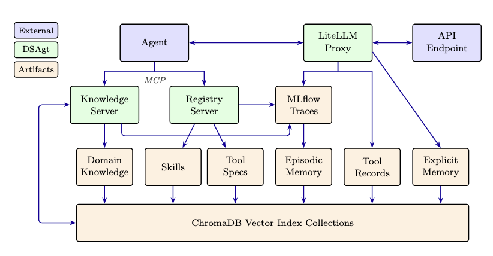
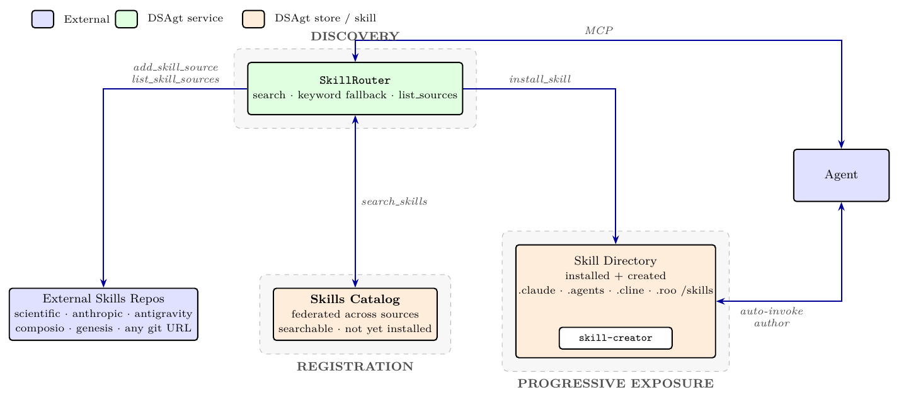

# DSAgt

**D**ata**S**mith **Ag**en**t** — AI-assisted data pipeline builder.



DSAgt connects an MCP-compatible AI coding agent to tool registration, a semantic knowledge base, execution provenance, and observability infrastructure. DSAgt provides data-pipeline scaffolding around a user's existing agent CLI or VS Code extension (Claude Code, Goose, Codex, …);

**Prerequisites:** Python 3.12 or 3.13, and one of the supported agent platforms below — already installed and authenticated against whatever LLM provider you intend to use. ([uv](https://github.com/astral-sh/uv) is only needed for the development install.)

<!-- md-shared:agents:start -->
| Agent | Install | Verify |
|-------|---------|--------|
| [Claude Code](https://github.com/anthropics/claude-code) | `npm i -g @anthropic-ai/claude-code` | `claude --version` |
| [Goose](https://github.com/block/goose) | See [Goose docs](https://github.com/block/goose#installation) | `goose --version` |
| [Codex](https://github.com/openai/codex) | `npm i -g @openai/codex` (or `brew install --cask codex`) | `codex --version` |
| [opencode](https://github.com/sst/opencode) | See [opencode docs](https://opencode.ai/docs/) | `opencode --version` |
| [Roo Code](https://github.com/RooCodeInc/Roo-Code) | `npm i -g @roo-code/cli` | `roo --version` |
| [Cline](https://github.com/cline/cline) | `npm i -g cline` | `cline --version` |
<!-- md-shared:agents:end -->

## Installation

### For use (no development)

<!-- md-shared:install:start -->
If you just want to *run* DSAgt against your own data and agent — no repo checkout, no `uv` — install it straight from GitHub into a virtual environment. Any Python 3.12/3.13 environment works (`venv`, conda, etc.); only the `pip install git+…` step is officially supported.

```bash
python3.12 -m venv ~/.venvs/dsagt          # or: conda create -n dsagt python=3.12 && conda activate dsagt
source ~/.venvs/dsagt/bin/activate         # (Windows venv: ~\.venvs\dsagt\Scripts\activate)
pip install "git+https://github.com/AI-ModCon/dsagt.git"
dsagt --version                            # 0.3.0
```

This puts the `dsagt` CLI (and the `dsagt-run` / `dsagt-*-server` helpers) on your PATH. Then build the shared knowledge base once and create your first project:

```bash
dsagt setup-kb                             # bundled tools + skills + reference corpora
                                           # (downloads a ~130 MB local embedder on first run)
dsagt init my-project --agent claude       # or: goose / codex / opencode / roo / cline
dsagt start my-project
```

To upgrade later, reinstall and re-run `setup-kb` to pick up new bundled tools/skills:

```bash
pip install --upgrade "git+https://github.com/AI-ModCon/dsagt.git"
dsagt setup-kb
```

> Pin to a specific release once tags are published, e.g. `pip install "git+https://github.com/AI-ModCon/dsagt.git@v0.3.0"`.
<!-- md-shared:install:end -->

### For development

Clone the repo and use `uv` (editable install with the full test suite) — see [Quick Start](#quick-start) below.

## Quick Start

Explore DSAgt knowledge ingest, tool registration, provenance, and explicit memory using the mock project in [`tests/smoke_test/`](tests/smoke_test/). Uses `claude`; substitute another agent (`goose` / `codex` / `opencode`) if you prefer — the prompts are agent-agnostic.

```bash
# 0. Installation
git clone https://github.com/AI-ModCon/dsagt.git
cd dsagt
uv sync                      # add --all-groups for the test suite
source .venv/bin/activate    # so `dsagt` is on PATH

# Set convenience folder env variable for quickstart demo (not a normal dsagt step)
export SMOKE_DIR="$(pwd)/tests/smoke_test"

# 1. Create a new project called quickstart
dsagt init quickstart --agent claude

# 2. Start MLflow in the background (writes <project>/mlflow.log) and print
#    the OTel routing exports for this session, including the resolved
#    experiment id:
dsagt mlflow quickstart

# 3. Paste the export block dsagt mlflow printed into THIS shell, then
#    launch claude from the project directory:
cd ~/dsagt-projects/quickstart && claude
```

Inside the agent, paste these prompts one at a time (substitute the absolute path you exported as `$SMOKE_DIR` — the chat doesn't expand env vars):

1. > Ingest the docs in `$SMOKE_DIR/knowledge/` into a collection named `knowledge`.
2. > Register the csvkit CLI tools `csvcut`, `csvgrep`, `csvstat`, and `csvlook`.
3. > Use the `scan_directory` tool from the registry to scan `$SMOKE_DIR/data/`.
4. > Summarize `samples.csv` — columns, row count, quality issues using csvkit tools from the registry.
5. > Put this in explicit memory: samples.csv has null values in the status and timestamp columns.
6. > Tell me what you remember about the samples dataset.

Exit the agent (`Ctrl+C` or `/exit`), then distill the session into episodic memory and stop the MLflow daemon:

```bash
# 4. After your session, distill traces into episodic memory:
dsagt memory --project quickstart

# 5. Stop the MLflow daemon dsagt mlflow started (writes a PID into
#    <project>/.runtime; this releases the port and the gunicorn workers):
dsagt stop quickstart
```

What this exercised:

| Prompt | Layer |
|---|---|
| 1 | `dsagt-server` (`kb_ingest`) — chunks and indexes docs into ChromaDB |
| 2 | `dsagt-server` (`save_tool_spec`) — writes `tools/csvcut.md`, `tools/csvgrep.md`, etc. (one per registered tool) |
| 3 | `dsagt-run` provenance wrapper — records exec layer to `trace_archive/` |
| 4 | Explicit memory (`kb_remember` → `explicit_memories.yaml`) + KB recall |

Verify the artifacts and view traces in the MLflow UI (URL printed by `dsagt mlflow`):

```bash
dsagt info quickstart
ls ~/dsagt-projects/quickstart/{tools,trace_archive}
cat ~/dsagt-projects/quickstart/explicit_memories.yaml
```

The same flow runs non-interactively via `dsagt smoke-test --agent claude` (or `goose` / `codex` / `opencode`), which asserts each artifact is present.

### First-time knowledge base setup

`dsagt setup-kb` builds the shared ChromaDB collections under `~/.dsagt/kb_index/` that every project on this machine reuses. Three of the six collections shown in the [architecture diagram](#architecture) are populated here — the other three are per-project and fill in automatically during use (see [Knowledge Base](#knowledge-base) below):

- **Tool Specs** — DSAgt's bundled tool specs from `src/dsagt/tools/`, tagged with `source: bundled` so the agent finds them via `search_registry` from the very first session.
- **Skills Catalog** — the default external skill source (`scientific`) cloned and frontmatter-indexed so `search_skills` returns installable skills from the first session. Add more (`dsagt skills add <project> genesis`, etc.). The bundled `skill-creator` is auto-discovered natively by the agent, not indexed.
- **Domain Knowledge** — Reference corpora (NVIDIA NeMo Curator, AI Data Readiness Inspector) downloaded and embedded so the agent has data-curation domain knowledge out of the box.

The Tool Specs collection is wipe-and-rebuild on every run, so re-run `setup-kb` after upgrading DSAgt to pick up new bundled tools. (Bundled skills are not indexed — agents auto-discover them natively.)

```bash
dsagt setup-kb                       # all collections (local embedder, no creds)
dsagt setup-kb --collection nemo_curator
dsagt setup-kb --embedding-backend api --embedding-base-url ... --embedding-api-key ...
```

The default embedder is a local sentence-transformers model (~130 MB of weights downloaded on first run, CPU-side, no API key). Pass `--embedding-backend api` to route through a hosted embedder via LiteLLM (15–30 minutes typical for the reference corpora, depending on rate limits).

## Use Case Examples

End-to-end walkthroughs for representative scientific domains live in [`use_cases/`](use_cases/). Each one covers data acquisition, tool registration, pipeline construction, and agent-driven execution against a real dataset.

| Use case | Domain | Guide |
|----------|--------|-------|
| Microbial isolate processing | Genomics — short-read QC and assembly with `fastp` + `megahit` | [isolate_demo.md](use_cases/microbial_isolates/isolate_demo.md) |
| Cryo-EM data curation | Structural biology — EMPIAR-10017 β-galactosidase micrographs via CryoPPP | [cryoem_demo.md](use_cases/cryoem/cryoem_demo.md) |
| ISAAC / VASP workflows | Materials science — DFT input/output handling with VASP | [use_cases/isaac_vasp/](use_cases/isaac_vasp/) |

## Project Directory

Default location: `~/dsagt-projects/<name>/`. Override with `--location`:

```bash
dsagt init my-project --agent claude --location /data/runs   # /data/runs/my-project/
dsagt init my-project --agent claude --location .            # ./my-project/
```

Projects are registered in `~/.dsagt/projects.yaml` so `dsagt mlflow <name>` and `dsagt info <name>` work from any directory. The data layer (knowledge base, MLflow store, registered tools, skills, audit records) is agent-agnostic, so re-running `dsagt init <same-name> --agent <other>` switches platforms while preserving everything you've accumulated.

```
~/dsagt-projects/cheese-metagenome/
  dsagt_config.yaml             # project configuration
  tools/                        # registered CLI tool specs (markdown + YAML frontmatter)
  tools/code/                   # agent-written tool scripts
  skills/                       # agent skills (SKILL.md + reference docs)
  trace_archive/                # tool execution records (JSON, from dsagt-run)
  mlflow/                       # MLflow traces, metrics, artifacts
  kb_index/                     # knowledge base vector collections
  explicit_memories.yaml        # user-confirmed facts loaded at session start

  # Per-agent runtime config (one of, generated by dsagt init):
  #   claude:   CLAUDE.md, .mcp.json
  #   goose:    goose.yaml, .goosehints
  #   codex:    AGENTS.md, .codex-data/config.toml
  #   opencode: AGENTS.md, opencode.json
  #   roo:      .roomodes, .roo/mcp.json
  #   cline:    .clinerules/, cline_mcp_settings.json (managed via cline mcp add)
```

### MCP Server

DSAGT exposes a single MCP server, **`dsagt-server`**, that an agent connects to once. It bundles two concern areas:

- **Registry** — Tool registration and dependency installation. Tools are markdown files with YAML frontmatter under `<project>/tools/`. Executables are wrapped with `dsagt-run` for provenance and `uv run --with` for Python dependencies. The agent discovers tools via `search_registry`.
- **Knowledge** — Semantic search over indexed document collections (FAISS / ChromaDB). Background jobs handle long ingest operations. The agent searches via `kb_search`, ingests via `kb_ingest`, and saves user-confirmed facts via `kb_remember`.

> **Upgrading from the two-server layout?** Earlier versions ran separate `dsagt-registry-server` and `dsagt-knowledge-server` processes. There is no automatic migration: re-run `dsagt start <project>` and the per-agent MCP config is regenerated to point at the single `dsagt-server`. For **cline** specifically, `cline mcp add` has no remove, so an upgraded project keeps stale `dsagt-registry`/`dsagt-knowledge` entries alongside the new `dsagt` one — delete `<project>/.cline-data` before `dsagt start` to get a clean config.

### Tools and Skills

**Tools** are CLI executables defined as markdown files with YAML frontmatter in `<project>/tools/`. The agent registers new tools via the MCP server's `save_tool_spec`.

**Skills** are instruction-based agent workflows — a directory with a `SKILL.md` and optional reference docs. They come in two tiers:

- **Installed** skills live in `<project>/skills/` (DSAgt ships a bundled `skill-creator`; domain skills like the MODCON datacard generator are installed from the `genesis` catalog). These are mirrored into the agent's native skill directory (e.g. `.claude/skills/`, `.agents/skills/`) at `dsagt init`/`start`, where the agent auto-discovers and auto-invokes them — no `search_skills` needed (that covers only the catalog tier below).
- **Catalog** skills come from external Git repositories — GitHub *or* GitLab — indexed into a searchable catalog the agent browses with `search_skills` but that is **not** loaded into its context (so a catalog can hold thousands of skills). The agent enables a source with `add_skill_source(...)`, finds skills with `search_skills(...)`, then copies one into the project with `install_skill(...)`.

The catalog is **opt-in**: a source must be synced before its skills are searchable. Curated named sources ship out of the box — `scientific`, `anthropic`, `antigravity`, `composio`, and `genesis` (the OSTI GENESIS catalog: HPC, HuggingFace, LangChain, OpenAI, plasma-sim, and more) — and any Git URL or `owner/repo` works too. Manage catalogs from the CLI with `dsagt skills list/search/add/sync <project>`, or from the agent with `list_skill_sources` / `add_skill_source` / `search_skills` / `install_skill`.



Skill handling runs through one service over two stores. **`SkillRouter`** is the single skill-MCP entry point — every skill tool routes through it: `add_skill_source` / `list_skill_sources` manage repos, `search_skills` queries the catalog, `install_skill` adopts a catalog skill into the project. **Registration** pulls skills from External Skills Repos (the curated `scientific` / `anthropic` / `antigravity` / `composio` / `genesis` sources, *or any git URL*) into the **Skills Catalog** — a federated, searchable store of *not-yet-installed* skills (semantic search, with a zero-dependency keyword fallback when no embedder is configured). **Discovery** is the catalog's irreplaceable job: surfacing skills the agent doesn't yet have, which native discovery can't see. **Progressive exposure** is native: the **Skill Directory** holds the project's installed + created skills in each agent's own skill dir (`.claude/skills`, `.agents/skills`, `.cline/skills`, `.roo/skills`), where the agent auto-discovers and model-invokes them by relevance — and authors new ones via the bundled **`skill-creator`** skill. The diagram source is [`latex/skills-routing.tex`](latex/skills-routing.tex).

### Knowledge Base

Six independently-partitioned ChromaDB collections hold everything the agent searches semantically. The first three are global (under `~/.dsagt/kb_index/`, populated by `dsagt setup-kb`); the last three are per-project (under `<project>/kb_index/`, populated automatically during use):

| Collection | Source | Populated by |
|---|---|---|
| **Tool Specs** | Bundled CLI tool specs in `src/dsagt/tools/` | `dsagt setup-kb` |
| **Skills Catalog** | Installable skills from external repos (one `skills_catalog__<slug>` per source), frontmatter-indexed | `dsagt setup-kb` (default source) + `add_skill_source` |
| **Domain Knowledge** | NeMo Curator + AIDRIN reference corpora; user-ingested docs | `dsagt setup-kb` + agent's `kb_ingest` |
| **Explicit Memory** | User-confirmed facts | Agent's `kb_remember` (also written to `<project>/explicit_memories.yaml`); the agent fetches via `kb_get_memories` on demand — typically when you ask it to recall — not auto-loaded at session start |
| **Episodic Memory** | Distilled facts from MLflow traces | `dsagt memory --project <name>` (per-category outlier detection via embedding centroids) |
| **Tool Use Records** | `dsagt-run` execution traces | `dsagt-run` wrapper writes JSON to `<project>/trace_archive/`; indexed into ChromaDB by `dsagt memory` |

The default embedding backend is local (sentence-transformers, CPU-side, no API needed). Switch to `embedding.backend: api` in `dsagt_config.yaml` to route through a hosted embedder via LiteLLM. Cross-encoder reranking is optional (`knowledge.rerank: true`).

The agent searches via `kb_search` and writes via `kb_ingest` / `kb_remember`. Registered tools have their own `search_registry` route over the same backend. Installed skills are auto-discovered natively by the agent (not indexed); enabling external skill catalogs adds one `skills_catalog__<slug>` collection per source, which `search_skills` browses for installable skills.

### Observability

MLflow runs at `http://localhost:<mlflow_port>` (pinned at init time, listed by `dsagt info`). The trace view shows:

- **Knowledge base operations** — `kb.search` / `kb.embed` / `kb.index_search` / `kb.rerank` span trees with per-phase timing.
- **Tool executions** — `tool.execute` spans with exit code, duration, file counts, truncated stderr. Full payload in `trace_archive/<record_id>.json`.
- **Registry events** — `save_tool_spec`, `install_dependencies`, `reconstruct_pipeline` spans.
- **Native agent OTel** *(optional)* — when you export `MLFLOW_TRACKING_URI` and `OTEL_EXPORTER_OTLP_ENDPOINT` (printed by `dsagt init`), the agent's own LLM-call traces land in the same MLflow store. Trace coverage varies by agent: claude / goose emit full payloads, codex emits token counts + tool names, opencode emits nothing natively.

Every span carries the project's `session.id` for filtering. Tool execution records on disk provide the canonical provenance chain — the agent calls `reconstruct_pipeline` to render the trace archive as a reproducible bash script or Snakemake workflow.

## CLI Reference

| Command | Description |
|---------|-------------|
| `dsagt init <name> --agent <platform> [--location <path>] [--mlflow-port N]` | Create a project; write per-agent MCP config; print launch one-liner |
| `dsagt mlflow <name>` | Run MLflow in the foreground against a project's store (port pinned at init time) |
| `dsagt memory --project <name>` | Distill new traces from this project's MLflow into episodic memory |
| `dsagt info <name> [--json]` | Resolved config (with source per value) and a session/error summary |
| `dsagt setup-kb [--collection <name>]` | Build the shared core knowledge base collections |
| `dsagt skills <sync\|add\|list\|search> <name> [source]` | Manage external skill catalogs and project skill installs |
| `dsagt list` | List all projects with agent, status, and path |
| `dsagt mv <name> <new-location>` | Move a project to a new location |
| `dsagt rm <name> [-y] [--keep-files]` | Unregister a project (and optionally delete its directory) |
| `dsagt smoke-test [--agent claude\|goose\|codex\|opencode]` | End-to-end install verification |

For tests, proxy mode, troubleshooting, and other developer-facing material, see [developer.md](developer.md).
