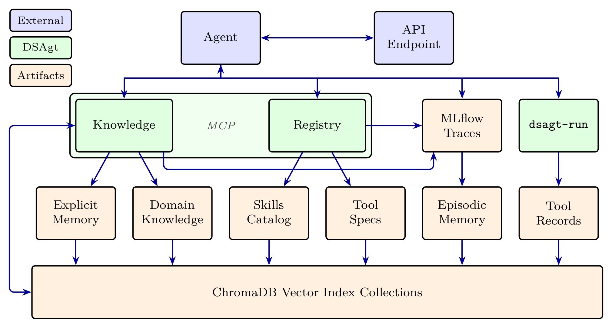

# Architecture



DSAgt provides a preconfigured agent platform with augmented capabilities for AI-ready scientific data processing and curation. Its capabilities are designed to complement rather than compete with the fast-moving agent platforms it runs on — Claude Code, Codex, Cline, opencode, and Goose. Most are exposed to the agent through a central MCP server: skill discovery and installation, data-processing code execution with provenance, knowledge-base extension and retrieval, and explicit and cross-session memory. Others are spawned by the server and run in the background: observability through MLflow traces, episodic memory management, and vector-store indexing. DSAgt also ships a suite of agent skills for AI-ready data workflows.

## Capabilities

**Code Registry** (`dsagt-server`)
The agent registers CLI data processing codes as markdown files with YAML frontmatter under `<project>/codes/`. DSAgt handles dependency installation via `uv run --with` and wraps every execution with `dsagt-run` for provenance capture. The agent discovers codes via `search_registry`.

**Knowledge Base** (`dsagt-server`)
Hybrid semantic + BM25 search over ChromaDB collections partitioned by concern — code specs, skill catalogs, scientific documents, and per-project memory — served by the same process as the code registry. A first `dsagt init` installs the bundled code specs and a default skill genesis-skills catalog; heavier scientific collections (NeMo Curator, AIDRIN) and additional skills catalogs are also available (e.g. k-dense, anthropic), and new collections can be added for the documents of a specific scientific pursuit. The agent searches via `kb_search`, ingests via `kb_ingest`, and saves user-confirmed facts via `kb_remember`. Opt-in episodic memory distills each session turn into the per-project `session_memory` collection.

**Provenance** (`dsagt-run`)
A wrapper around every registered-code execution. Records the command, arguments, exit code, duration, file counts, and truncated stderr to `<project>/trace_archive/<record_id>.json` and emits a `code.execute` span to the trace store. The server incrementally embeds those records into a `code_use` collection so past executions are retrievable, and the agent calls `reconstruct_pipeline` to render the trace archive as a reproducible workflow.

**Observability** (serverless MLflow)
Traces land in a serverless MLflow store — a SQLite file at `<project>/mlflow.db`. DSAgt emits its own spans live; the agent's LLM-call traces are recovered post-hoc from the on-disk session transcript by the MCP server's in-session reader. View with `dsagt traces <project>`.

**Skills Discovery**
DSAgt exposes MCP tools to connect to external GitHub skill repositories and search them for skills that enhance scientific workflows. On top of the agent's own progressive disclosure of the skills already installed in its native skill folder, DSAgt maintains an extendable knowledge base of skills that can be searched and installed on demand — without flooding the agent's context window with skills it isn't using. The agent searches via `search_skills` and installs via `install_skill`.

**Memory**
DSAgt adds two memory extensions that complement the host agent's own memory (which distills session facts into a managed set of Markdown files loaded into context). *Explicit memory* records user-confirmed facts as YAML (`kb_remember` / `kb_get_memories`). *Episodic memory* (opt-in) keeps a vector store of semantically chunked turn blocks and searches them by successive filtering — first to a session, then by regex over the query's key themes, then a final vector ranking of what remains — so long, multi-session history can augment agent context without the noisy retrieval that undifferentiated episodic accrual would otherwise produce.

## Project Layout

```
~/dsagt-projects/<name>/
  .dsagt/                       # dsagt-internal state (hidden)
    config.yaml                 # project configuration (set by dsagt init)
    state.yaml                  # session log + memory cursor (owned by the MCP server)
    explicit_memories.yaml      # user-confirmed facts
  codes/<name>/                 # registered codes — skill-standard dirs (SKILL.md + scripts/)
  skills/                       # agent skills (SKILL.md + reference docs)
  trace_archive/                # code execution records (JSON, from dsagt-run)
  mlflow.db                     # serverless MLflow SQLite trace store
  kb_index/                     # knowledge base vector collections

  # Per-agent runtime config (one of, generated by dsagt init):
  #   claude:   CLAUDE.md, .mcp.json
  #   goose:    goose.yaml, .goosehints
  #   codex:    AGENTS.md, .codex-data/config.toml
  #   opencode: AGENTS.md, opencode.json
  #   cline:    .clinerules/, cline_mcp_settings.json
```

Projects are registered in `~/dsagt-projects/projects.yaml` so `dsagt <cli-cmd> <project>` works from any directory.  The project's data is agent-agnostic — re-running `dsagt init <project>` for an existing project and choosing a different agent switches platforms while preserving all accumulated knowledge and traces. `dsagt rm <project>` deletes the project directory (and all accumulated project assets within) and updates the `projects.yaml` registry. 
