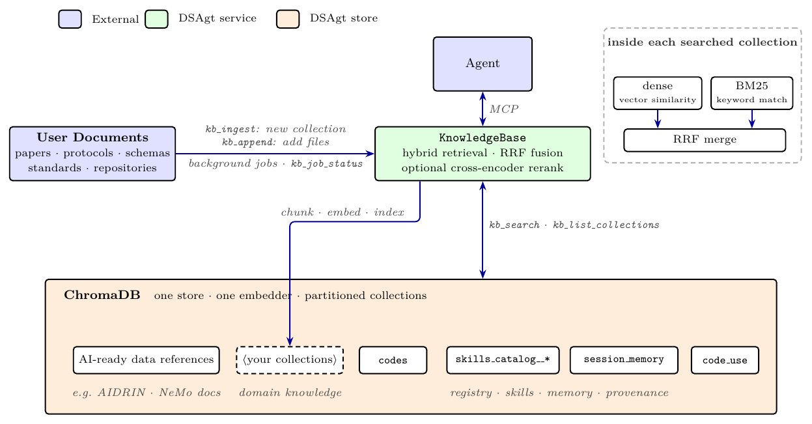

# Knowledge Base

The knowledge base is DSAgt's catalog of **domain knowledge** — reference corpora and your own documents — that the agent searches to ground its work on scientific data-processing and AI-readiness evaluation.



## Domain-knowledge collections

| Collection | Source | Populated by |
|---|---|---|
| **Reference corpora** | NeMo Curator + AIDRIN (data-curation and AI-data-readiness references) | `dsagt init` (chosen collections) |
| **Your documents** | Papers, standards, protocols, schemas you ingest | Agent's `kb_ingest` |

The has access to three knowledge base tools: `kb_ingest` (index a file or directory into a named collection — long ingests run in the background), `kb_search` (retrieve across one or more collections), and `kb_list_collections` (see what's indexed).

## Hybrid vector search

Retrieval is **hybrid** — dense semantic embeddings fused with sparse BM25 keyword matching — by default per collection for focused retrieval:

- **Semantic embeddings** catch paraphrase and synonymy: a query about "missing values" finds a passage on "null rates" even with no shared words.
- **BM25 keyword matching** catches the exact terms embeddings tend to under-rank — identifiers, gene names, parameter flags, standard names — where a literal match matters.
- **Per-collection partitioning** scopes a search to a domain, so a materials-science query isn't diluted by genomics references.
- **Optional cross-encoder reranking** re-scores the top candidates for precision when it's worth the extra pass.

The default embedder is a local sentence-transformers model (~130 MB).
## Shared vector store

The same vector store additionally supports DSAgt's [memory](memory.md) (explicit + episodic), [skills discovery](skills.md) (the installable-skill corpus), and [code execution tracking](provenance.md) (the `code_use` records). Each is a separate partitioned collection in that store, sharing one embedder and one ChromaDB. Respective docs on [memory](memory.md), [skills](skills.md), and [provenance](provenance.md) share specific details about those collections.

## Setup

`dsagt init` sets up the knowledge base from your choices in the interactive menu. 

## Try it

```bash
dsagt init            # name it `demo`, and enable the AIDRIN collection in the prompts
dsagt start demo
```

Then, in the agent — substituting `<your-docs-folder>` with any folder of your
own documents (papers, protocols, schemas):

1. > Ingest the docs in `<your-docs-folder>` into a collection named `domain`.
2. > Search the `domain` and `aidrin` collections for how to assess data completeness.

