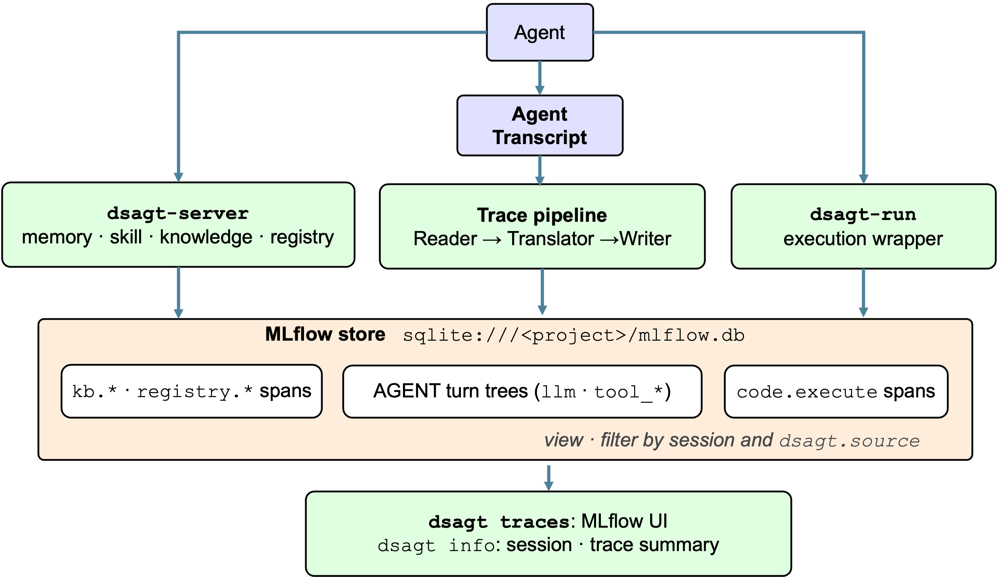

# Observability

DSAgt logs traces to a serverless **MLflow** store, an SQLite file at `~/dsagt-projects/<project>/mlflow.db`.



To view in the MLflow UI:

```bash
dsagt traces <project> # mlflow ui --backend-store-uri sqlite:///<project>/mlflow.db
```

`dsagt info <project>` prints the resolved tracking URI and a session/trace summary. 

## Trace sources

DSAgt reconstructs traces from what the agent writes to disk.

1. **DSAgt spans (live).** DSAgt instruments its own code and emits spans directly to mlflow as it runs.
2. **Agent traces (post-hoc).** The MCP server periodically reads the agent's own on-disk session transcript, translates it to a canonical trace shape, and writes it to the same store via the MLflow sink — recovering prompts, responses, and tool calls.

## Trace Coverage

| Source | Span type | Contents |
|--------|-----------|----------|
| Knowledge base | `kb.search`, `kb.embed`, `kb.index_search`, `kb.rerank` | Per-phase timing trees |
| Code executions | `code.execute` | Exit code, duration, file counts, truncated stderr. Full payload in `trace_archive/<record_id>.json` |
| Registry events | `registry.save_code_spec`, `registry.install_dependencies`, `registry.reconstruct_pipeline` | Span metadata |
| Agent traces | one AGENT subtree per turn (`llm` / `tool_<name>` children) | Prompts, responses, tool calls, and token usage where the transcript carries them |

### Agent trace coverage

Agent traces are reconstructed from each agent's on-disk session record. A per-agent reader + translator runs for every supported agent (claude, codex, goose, opencode, cline), uniformly. Fidelity is capped by what the transcript persisted (e.g. token counts and timing appear where the agent recorded them).

Every span carries the project's session id for filtering in the MLflow trace view.

The trace scan runs every 45 seconds inside the MCP server. Each pass reads new transcript records, translates the completed turns to the canonical trace, and hands them to the MLflow sink and, when episodic memory is on, to the memory indexer.

## Try it

```bash
dsagt init            # follow the prompts: name it `demo`, then pick your agent
dsagt start demo      # …run a prompt or two, then exit the agent
dsagt traces <project>
```

Open MLflow UI to see both feeds in one store: DSAgt's own `kb.*` / `code.execute` spans and the per-turn agent traces recovered from the transcript. `dsagt info demo` prints the same session/trace summary from the command line.
