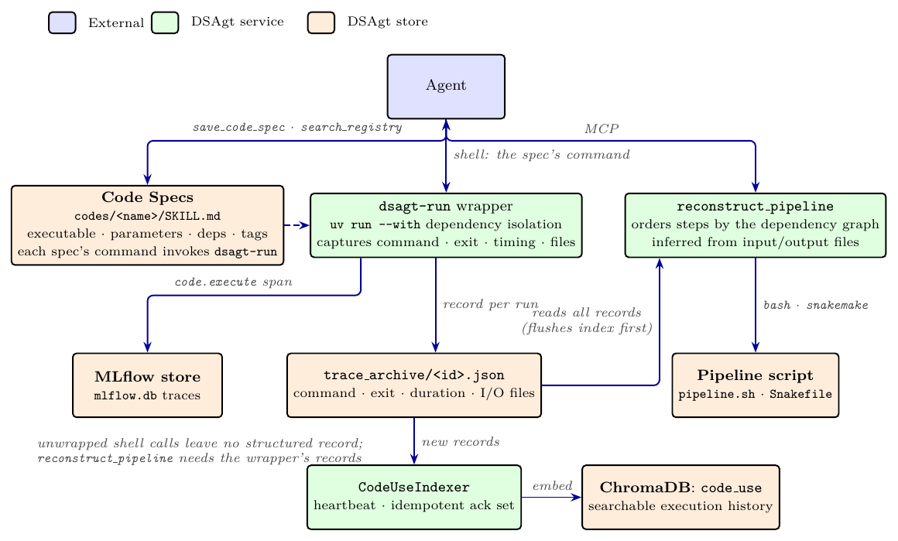
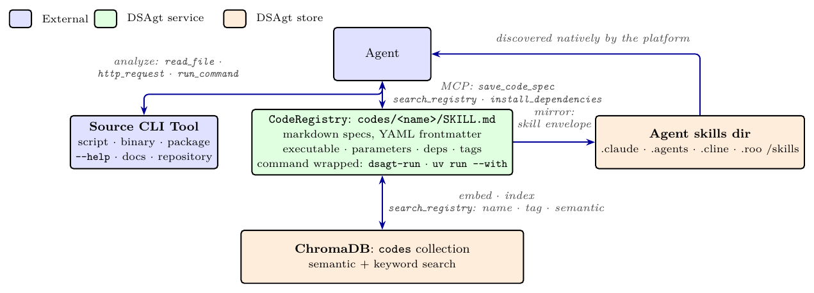

# Provenance

DSAgt makes every data operation a reproducible, auditable step. The agent registers a **code** — a CLI executable — and every run of that code is wrapped for provenance capture, so the whole pipeline can later be reconstructed from the record.



## Codes

Codes are CLI executables defined as markdown files with YAML frontmatter under `<project>/codes/`. The agent registers new codes via the MCP server's `save_code_spec` tool and finds existing ones via `search_registry`.



A code spec includes:

- A YAML frontmatter block describing the executable, parameters, dependencies, and tags.
- A markdown body with the exact runnable command, usage, and notes for the agent.

Example code spec (`codes/csv-summary/SKILL.md`):

```markdown
---
name: csv-summary
description: Summarize a CSV — columns, row count, null counts, numeric stats. Use when profiling a tabular dataset.
executable: dsagt-run --code csv-summary -- python codes/csv-summary/scripts/csv_summary.py
parameters:
  file:
    type: string
    required: true
    cli: positional
    description: Path to the CSV file
dependencies: []
tags: [csv, profiling]
---

Run this registered code with the exact shell command below…
```

DSAgt wraps every registered code with `dsagt-run` for provenance capture and `uv run --with` for Python dependencies, so the agent can call any code without managing environments manually. It provides one built-in code, `scan-directory`, indexed for search by `dsagt init`.

## Execution capture

Every registered code runs through the `dsagt-run` wrapper. For each call it records the command, arguments, exit code, duration, input/output file counts, and truncated stderr to `<project>/trace_archive/<record_id>.json`, and emits a `code.execute` span to the [trace store](observability.md). The MCP server incrementally indexes those records into the `code_use` collection, so past executions are searchable.

The wrapper is the point of code-mediated data access. A direct shell or editor call isn't recordless — the agent's transcript still captures whatever it chose to report about the command and its stdout/stderr — but that's a partial, agent-curated account, not the structured `dsagt-run` record of exit code, timing, and input/output files. Only the wrapped record carries what `reconstruct_pipeline` needs, so a direct call still breaks reconstruction.

## Pipeline reconstruction

The on-disk execution records are the canonical provenance chain. The agent calls `reconstruct_pipeline` to render the trace archive as a reproducible **bash script** (`format="bash"`) or **Snakemake workflow** (`format="snakemake"`). It flushes the latest records into the searchable index first, then walks the dependency graph inferred from each step's input/output files to order the steps.

## Try it

```bash
export SMOKE_DIR="$(pwd)/tests/smoke_test"   # a small built-in sample script + CSV
dsagt init            # follow the prompts: name it `demo`, then pick your agent
dsagt start demo      # launch the agent in the project
```

Then, in the agent (replace `$SMOKE_DIR` with the absolute path you exported):

1. > Register the CLI utility at `$SMOKE_DIR/csv_summary.py` as a code named `csv-summary`.
2. > Run the `csv-summary` code from the registry on `$SMOKE_DIR/data/samples.csv` and summarize the columns.
3. > Reconstruct the pipeline as a bash script.

Afterwards, inspect the trail:

```bash
ls ~/dsagt-projects/demo/{codes,trace_archive}          # the specs + execution records
mlflow ui --backend-store-uri sqlite:///$HOME/dsagt-projects/demo/mlflow.db   # code.execute spans
```