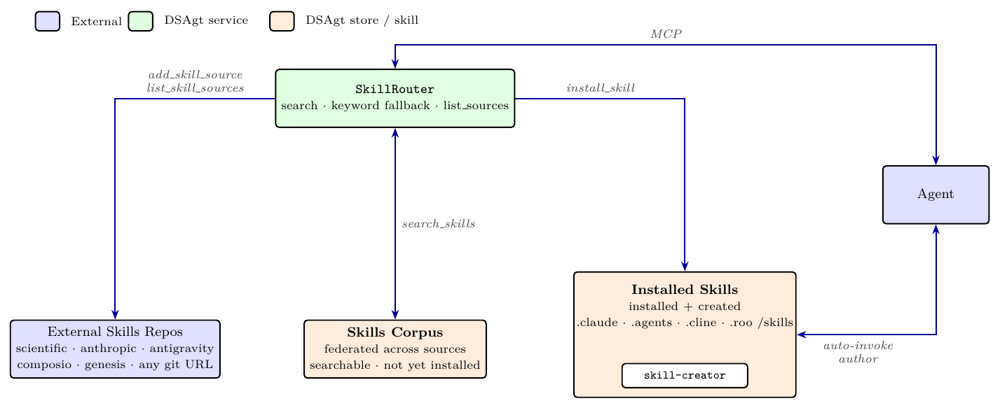

# Skills

DSAgt enables an agent to discover and install skills from an external corpus during a session.

Agent installed and DSAgt core Skills are located in `<project>/skills/`. Each is a directory containing a `SKILL.md` file and optional reference documents.

## Corpus and installed skills



Skills fall into two sets — the searchable **corpus** and the project's **installed skills** — and a single MCP service, the **SkillRouter**, routes every skill operation between them:

- **Corpus** — skills that exist in external repositories but are *not yet installed*. DSAgt federates many sources (`k-dense-ai`, `anthropic`, `antigravity`, `composio`, `genesis`, or any git URL); each is cloned and indexed into its own collection. The agent browses the corpus with `search_skills` and manages sources with `add_skill_source` / `list_skill_sources`.
- **Installed skills** — skills drawn into the project's `<project>/skills/` directory, either installed from the corpus (`install_skill`) or authored in place (e.g. with the built-in `skill-creator`). These are mirrored into each agent's *native* skills directory (`.claude/`, `.agents/`, `.cline/`) at install time (and re-mirrored at `dsagt init`/`start`), where the agent auto-discovers and auto-invokes them.

## Design motivation

- **Corpus search.** Every supported agent (Claude, Codex, Goose, Cline, opencode) natively auto-discovers `SKILL.md` folders, so installed skills never need to be indexed or returned by a tool. So `search_skills` discovers new skills for an agent to access: a corpus of potentially thousands of *un*installed skills, searchable without holding them all in context. The corpus is indexed on name, description, and tags, which keeps those summaries compact and avoids diluting the embedding with full SKILL.md bodies.
- **Keyword fallback** When no embedding model is configured, `search_skills` falls back to a keyword match over the local clones.

- **Federated and provenance-preserving.** Each source is an independent per-source collection, so re-syncing one never disturbs another; installing a skill from the corpus preserves its upstream `LICENSE`/`NOTICE` and stamps a `PROVENANCE.txt` into the installed directory.

## Built-in and authored skills

DSAgt provides a `skill-creator` skill (for scaffolding new `SKILL.md` skills). Built-in and installed skills are **not** indexed for search — the agent auto-discovers `SKILL.md` folders natively — so `search_skills` is reserved for the corpus. Domain skills, including the MODCON `datacard-generator`, are sourced from the external corpus rather than built in, so they stay current upstream.

To manually add a skill, place a new directory under `<project>/skills/` with a `SKILL.md` describing the workflow; the next `dsagt start` mirrors it into the agent's native skill directory, after which the agent auto-discovers and invokes it — no indexing step.

## Try it

```bash
dsagt init            # follow the prompts: name it `demo`, then pick your agent
dsagt start demo      # launch the agent in the project
```

Then, in the agent:

1. > List the skill sources and their sync status.
2. > Sync the `genesis` source and search it for a data-card skill.
3. > Install the one that fits, then use it on this project.
