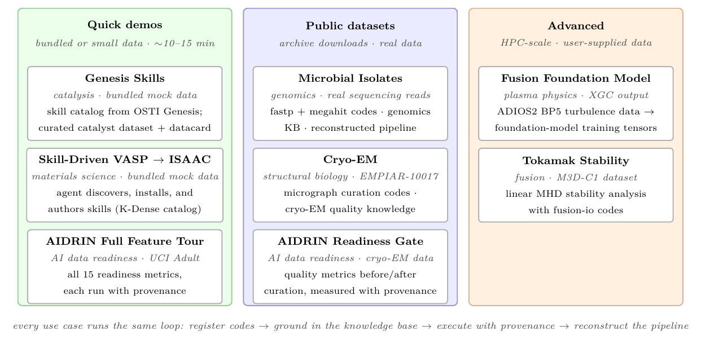

# Use Cases

End-to-end walkthroughs for representative scientific and data-readiness scenarios are located in [`use_cases/`](https://github.com/AI-ModCon/dsagt/tree/main/use_cases/). Each covers data acquisition, code registration, pipeline construction, and agent-driven execution against a real dataset.

<!-- USE_CASES_TABLE -->

!!! note "Adding a use case"
    Drop a `README.md` with frontmatter (`title`, `domain`, `summary`) into a
    `use_cases/<name>/` folder — it is auto-added to this table, gets its own
    page, and appears in the nav. Folders without frontmatter are left out
    entirely. See
    [`hooks/gen_use_cases.py`](https://github.com/AI-ModCon/dsagt/blob/main/hooks/gen_use_cases.py).
